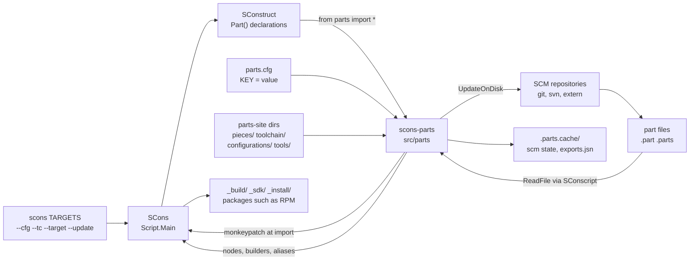
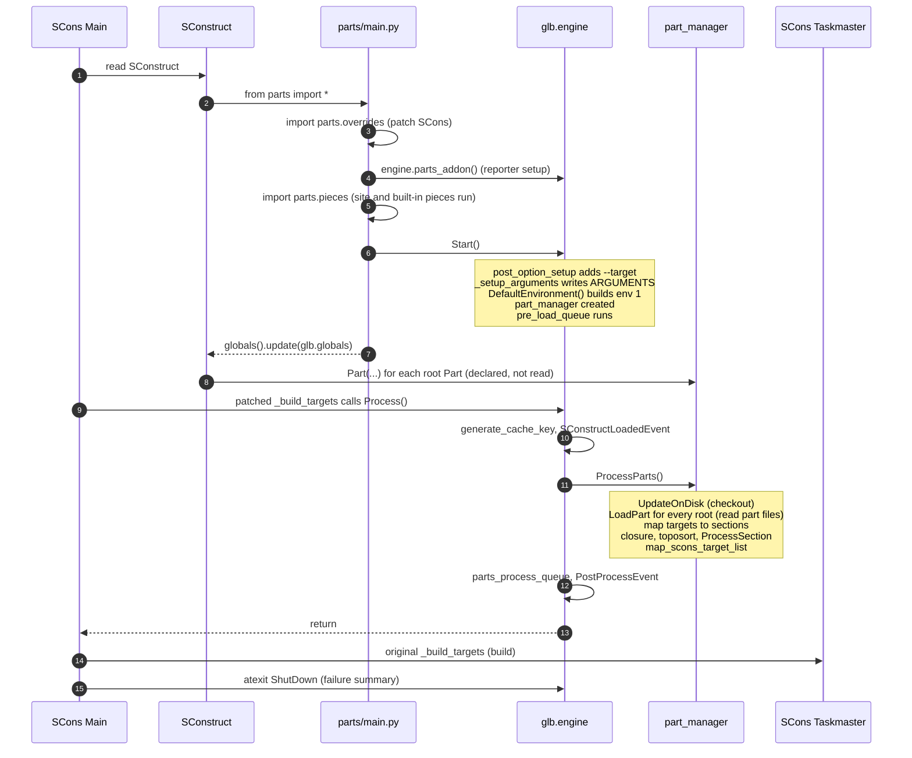
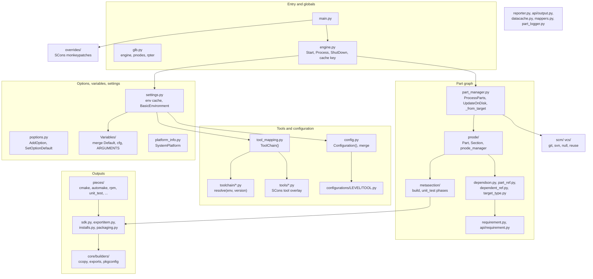

# L0: Overview

Parts extends SCons without wrapping it. A user runs `scons`. SCons reads the SConstruct. The SConstruct does `from parts import *`, and that import installs Parts: it patches SCons internals, loads site extensions, and builds the default environment. The SConstruct then declares Parts. When SCons is about to build, a patched hook hands control to the Parts engine, which checks out sources, reads part files, resolves dependencies, and defines the build nodes. SCons then builds as usual.

## System context

In a large build the SConstruct can hold hundreds of `Part()` calls, part files often come from a separate repository through `extern=`, and the pieces, toolchains, and configurations live in a shared parts-site.

## Process lifecycle

Notes:

- `engine.Process()` returns early when `BUILD_TARGETS` is empty, so `scons` with no target reads no part file. Use `scons all`.
- The default target is cleared in `Start()` (`def_env.Default('')`), so nothing builds without a target.
- With `extract_sources` as the only target, `ProcessParts()` returns after `UpdateOnDisk()` without reading any part file; `engine.Process()` still runs the post-process queue and `PostProcessEvent`.
- Details of each step are in [01-startup.md](01-startup.md) and [03-part-loading.md](03-part-loading.md).

## Module map

Parts-specific behavior is spread across four kinds of extension point, all searched on the site path ([01-startup.md](01-startup.md#site-search-path)):

| Extension | Directory | Loaded | Contract |
| --- | --- | --- | --- |
| Piece | `pieces/` | Every file, at `import parts`, before the engine starts | Module body runs. Registers methods, variables, options, platforms, queue hooks |
| Toolchain | `toolchain/` | By name, when an environment applies its toolchain | `resolve(env, version)` returns a list of `(name, config)` |
| Configuration | `configurations/<level>/` | By tool, host, and target, when an environment applies its configuration | `config.VersionRange()` rules |
| Tool | `tools/` (and SCons tool path) | By name, from a resolved toolchain | SCons tool `generate(env)` and `exists(env)` |
