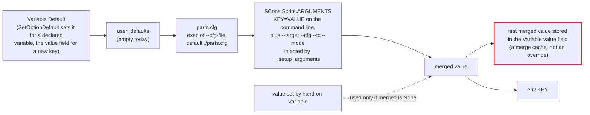
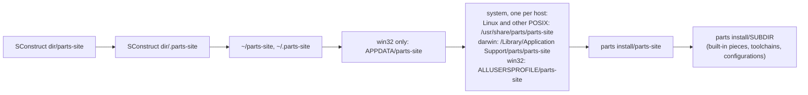

# L1: Start-up

Up to `globals().update(glb.globals)` in the first diagram, everything on this page happens inside `from parts import *`, before the next line of the SConstruct runs; the later steps show where the start-up hands over. The order matters: what a piece or hook can see depends on when it runs.

## Import order

```mermaid
flowchart TD
    A["SConstruct: from parts import *"] --> B["main.py: glb.rpter = reporter()"]
    B --> C["import modules<br/>overrides patch SCons<br/>poptions adds options, --tc split on _<br/>platform_info builds platform tables"]
    C --> D["glb.engine = parts_addon()<br/>reporter.Setup: color, verbose, trace"]
    D --> E["import parts.pieces<br/>loadAllPieces: every pieces/*.py<br/>on the site path, module body runs"]
    E --> F["engine.Start()"]
    subgraph startbox["engine.Start()"]
        F1["glb.pnodes = pnode_manager()"] --> F2["post_option_setup<br/>adds and converts --target"]
        F2 --> F3["_setup_variables: build mode"]
        F3 --> F4["_setup_arguments<br/>writes TARGET_PLATFORM, CONFIG,<br/>toolchain, mode, CCOPY_LOGIC<br/>into SCons.Script.ARGUMENTS"]
        F4 --> F5["SCons.Script.DefaultEnvironment()<br/>env 1: toolchain resolve,<br/>configuration files import"]
        F5 --> F6["def_env.Default('')<br/>EnsureSConsVersion 4.4"]
        F6 --> F7["_setup_logger, help, progress"]
        F7 --> F8["part_manager() created<br/>atexit ShutDown registered"]
        F8 --> F9["pre_load_queue()"]
    end
    F --> F1
    F9 --> G["globals().update(glb.globals)<br/>Alias('extract_sources')"]
    G --> H["rest of SConstruct runs"]
    H --> I["engine.Process() via patched _build_targets"]
    I --> J["ProcessParts()"]
    J --> K["parts_process_queue()<br/>post-process queue"]
    K --> L["PostProcessEvent"]
```

`_setup_arguments` flows straight into `DefaultEnvironment()`, and `pre_load_queue()` is the last step of `Start()`. No hook runs between the arguments being set and env 1 being built.

## Phases and what each one can do

| Phase | When | Available | Must not |
| --- | --- | --- | --- |
| Import | Piece module bodies, step E above | Options added so far (SCons re-parses after each `AddOption`), `GetOption('cfg_file')`, `KEY=VALUE` in `ARGUMENTS`, platform tables (`AddOS`, `AddArchitecture`) | Read `--target` (not added yet). Build an environment: it would lack `--target`/`--tc`, lack builders that Parts' own pieces register later, and be cached |
| Environment | Inside `DefaultEnvironment()` | Merged variables, `toolchain/*.py resolve()`, configuration import | Call `SetOptionDefault()` (it clears the cache mid-build) |
| Pre-load | End of `Start()` | The default environment and toolchain-derived values such as the gcc version | |
| SConstruct | After the import returns | Everything | Expect parts to be read (they are only declared) |
| Post-process | After `ProcessParts()` | Every read Part and processed section | |

Custom platforms belong in a piece module body: pieces run before `post_option_setup()` converts `--target`, so `AddOS('x')` in a piece makes `--target=x-...` valid. The SConstruct is too late for that.

## Variable precedence

`Variables.Update()` (`Variables/variables.py`) fills each variable in this order. A later source wins.

Rules that follow from this:

- A value that must beat `parts.cfg` must be written into `SCons.Script.ARGUMENTS`, the way `_setup_arguments` does for `--target`. `SetOptionDefault()` and `vars[key] = ...` both lose to `parts.cfg`.
- Never seed a merge from the value field. `Variable.Update()` stores the first merged value there (only while the field is `None`), so seeding from it would let an earlier merge beat a later `SetOptionDefault()` (this broke `install1` and six other gold tests when tried).
- `Variable.Default` and `Variable.Value` fire the change event from their getters when the value is `None` or mutable. The event reaches `Settings._handle_var_change()`, which empties the whole environment cache. Reading a variable can drop every cached environment.
- `SetOptionDefault()` after env 1 exists clears the cache, so the default environment and its toolchain `resolve()` are built again. `glb.engine.def_env` keeps pointing at the old one until the next `DefaultEnvironment()` call rebinds it (`overrides/default_env.py`).
- `Variables.__setitem__` and `__setattr__` assign `.value` (lowercase) to an existing variable, which `Variable` does not read (it uses `Value` and a private field). The assignment is silently lost.

## Hook queues

| Queue | Register with | Runs |
| --- | --- | --- |
| Pre-load | `glb.engine.add_preload_logic_queue(fn)` | End of `Start()` |
| Post-process | `glb.engine.add_preprocess_logic_queue(fn)` | After `ProcessParts()` |

## Site search path

`load_module.get_site_directories(subdir)` builds one ordered list per subdirectory (`pieces`, `toolchain`, `configurations`, `tools`, `loggers`). Earlier entries are more specific.

- `--use-parts-site=DIR` replaces the list with `DIR/SUBDIR` and the parts install.
- `--disable-global-parts-site` is a no-op: the option is `store_false` with default `False` (`poptions.py`), so the branch of `get_site_directories()` that would keep only the SConstruct-local and install entries never runs.
- `load_module()` caches every module in `sys.modules` as `parts.TYPE.NAME`, where TYPE is the subdirectory for pieces, toolchains, and loggers, and `config<level>` for configuration files (`configtype` for a level's `__init__.py`). The first directory that has the name wins, and the name is then pinned for the run. Tools are not loaded by `load_module()`: `overrides/tool.py Parts_Tool` (Parts' copy of SCons' tool loader) searches the toolpath, then `SCons.Tool`, and caches the module under the bare tool name or `SCons.Tool.NAME`.
- If a module raises while it executes, `load_module()` leaves the half-executed module in `sys.modules`, so a later load of the same name returns the partial module without the error.
- Pieces: `loadAllPieces()` imports every file in every directory, but a piece whose file name repeats a name already loaded is skipped. A site piece therefore shadows a built-in piece of the same name. Within one directory the order is the unsorted `glob.glob` order.

## Known defects in this area

| Defect | Where | Status |
| --- | --- | --- |
| An environment built at import time becomes the build environment, ignoring `--tc` and `--target`, and lacks late-registered builders | `settings.py` cache | Open |
| `.value` typo in `Variables.__setitem__`/`__setattr__` | `Variables/variables.py` | Open |
| `def_env` goes stale after a cache clear | `engine.py def_env` | Open; rebound only by the next `DefaultEnvironment()` call |
| Getters fire the change event | `Variables/variable.py` | Open |
| A module that fails to execute stays cached in `sys.modules` | `load_module.py load_module()` | Open |
| `--disable-global-parts-site` does nothing | `poptions.py` | Open |
