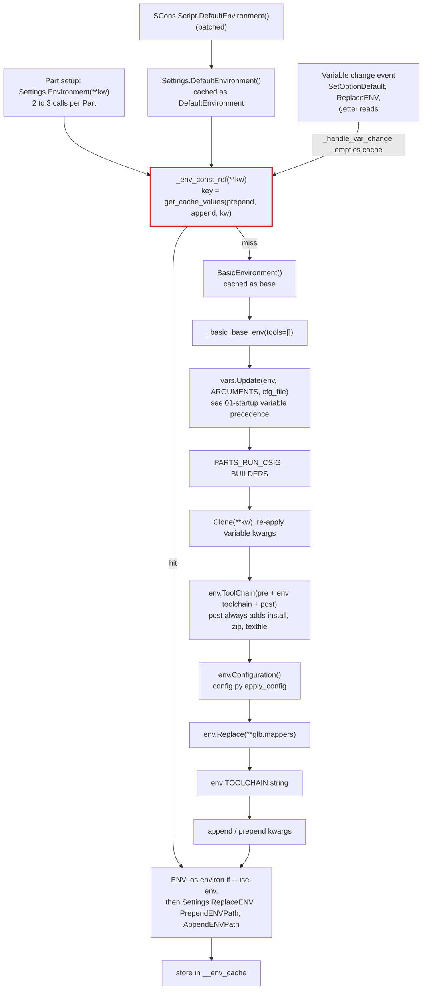
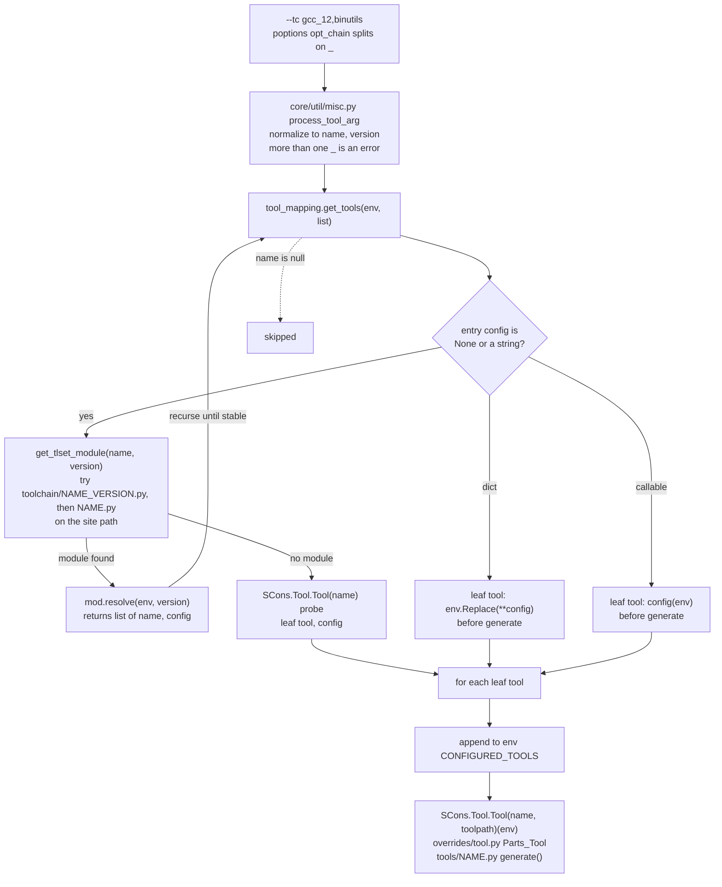
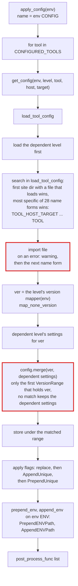

# L1/L2: Environments, toolchains, and configuration

Every Parts environment comes from one funnel, `Settings._env_const_ref()` in `settings.py`. It builds a base environment from the merged variables, applies the toolchain, then applies the configuration (debug, release, and site levels) for each configured tool. Results are cached by a key made from the keyword arguments.

## Building an environment

- `DefaultEnvironment()` returns a clone of `_env_const_ref()`; `_env_const_ref()` itself returns a shared instance that callers must not modify.
- The cache key is weaker than it looks: `get_cache_values()` starts its whitelist with `string_tester('*')`, which matches every key, so every keyword argument enters the key, and the values are joined with no separator. Sub-parts inherit the parent's `CHECK_OUT_DIR`, so misses scale with distinct parent checkout directories.
- Each Section clones its Part's environment once more ([04-sections-and-dependencies.md](04-sections-and-dependencies.md)).

## Toolchain resolution

`--tc` / `--toolchain` and `env['toolchain']` hold a list of `[name, version]` entries. `tool_mapping._ToolChain()` turns it into tools applied to the environment.

Example: `toolchain/default.py` picks a compiler family by host and target; on a POSIX host without the Intel compiler it returns `[('gxx', None)]`. `toolchain/gxx.py resolve()` returns `[('g++', f), ('gcc', f), ('ar', None), ('gas', None), ('gnulink', None)]` (`applelink` and `lipo` instead of `gnulink` on darwin), where `f` threads the version into `GXX_VERSION`/`GCC_VERSION`. `ar` has no toolchain module, so it becomes a leaf tool.

Consequences:

- A site `toolchain/gcc.py` shadows the built-in one for the whole run (`sys.modules` pins `parts.toolchain.gcc`), and if it returns `('gcc', None)` or `('gcc', 'VERSION')` that entry resolves to itself again. Compose a base by using a different name (`default` → `gxx` works for this reason).
- The version string is what drives compiler discovery: `resolve()` passes it into `*_VERSION`, and the GnuCommon tool layer looks for that version.
- When the `SCons.Tool.Tool(name)` probe raises for any reason, including an error inside an existing tool module, the build stops with "Failed to load Unknown ToolChain or Tool" and no traceback.

### The tool overlay

`tools/*.py` sit on top of `SCons/Tool/*.py`. They reach the base in three different ways, which is why a fix often applies to one language and not its sibling:

| Pattern | Tools | Risk |
| --- | --- | --- |
| Call base `generate()`, then override with `env[...] =` | `cc` (fixed in `8d6c7a2`), `ar`, `gnulink`, `javac` | Correct pattern. Use it |
| Call base `generate()`, then `SetDefault()` | `applelink` (`DSYMUTIL`) | Works today only because SCons' `applelink` does not set `DSYMUTIL`. `SetDefault` would become a silent no-op if SCons started setting it |
| Rebuild without the base | `c++`, `masm`, `msvc`, `mslink`, `mslib`, `midl`, `msvs` | Copies of base command strings drift from SCons |
| Via a Parts sibling | `gcc` → `parts.tools.cc`, `g++` → bare `c++`, `clang`/`aocc` → both | Asymmetric inheritance |

## Configuration selection

`env.Configuration()` is `config.apply_config()`. Levels form a chain through `DefineConfiguration(name, dependsOn)`: `debug` and `release` depend on `default`, and a site can add levels. The user documentation is [configurations.rst](../source/concepts/configurations.rst).

Rules worth knowing:

- Exactly one file loads per level, tool, host, and target. A platform-named file such as `gcc_any-x86_64_any-x86.py` replaces the generic `gcc.py` of the same level; it does not add to it. Levels still stack.
- A configuration file that raises on import does not stop the build. `load_tool_config()` prints a warning once and tries the next, less specific name, so an error in `gcc_posix-x86_64.py` falls back to `gcc.py` with only that warning.
- Only the first matching `VersionRange` applies: `configuration.merge()` stops at the first range, in declaration order, that holds the version. A later overlapping block is dead for every version an earlier block covers. For example, the `"7-*"` block in `default/gcc.py` (`-fdiagnostics-color=always`) never applies, because the `"*"` block before it matches every version.
- `merge()` resets the `prepend_env` and `append_env` lists before it adds the current level's, so a level whose matching range runs replaces the `ENV` additions of the levels below it instead of extending them. `post_process_func` entries accumulate across levels.
- A `post_process_func` runs after every level's flags, so a derived level cannot `filter` or `replace` what a base level's function set.
- `--use-env` replaces `env['ENV']` with `os.environ` after the configuration is applied, which discards the configuration's `ENV` additions.
- `--verbose=configuration` shows which file loaded and the merged settings; the per-directory file search and version resolution are under `--trace=configuration`.
- `loadlogic/changed.py` would use `get_defining_config_files()` for a configuration up-to-date check, but nothing on the active load path calls that loader ([07-overrides-caches-dead-code.md](07-overrides-caches-dead-code.md#dead-code)).
