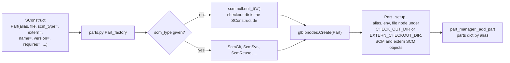
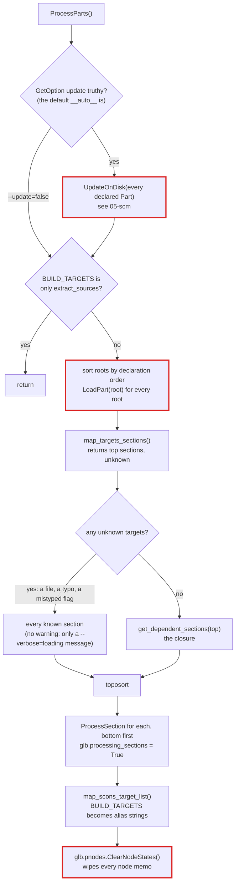
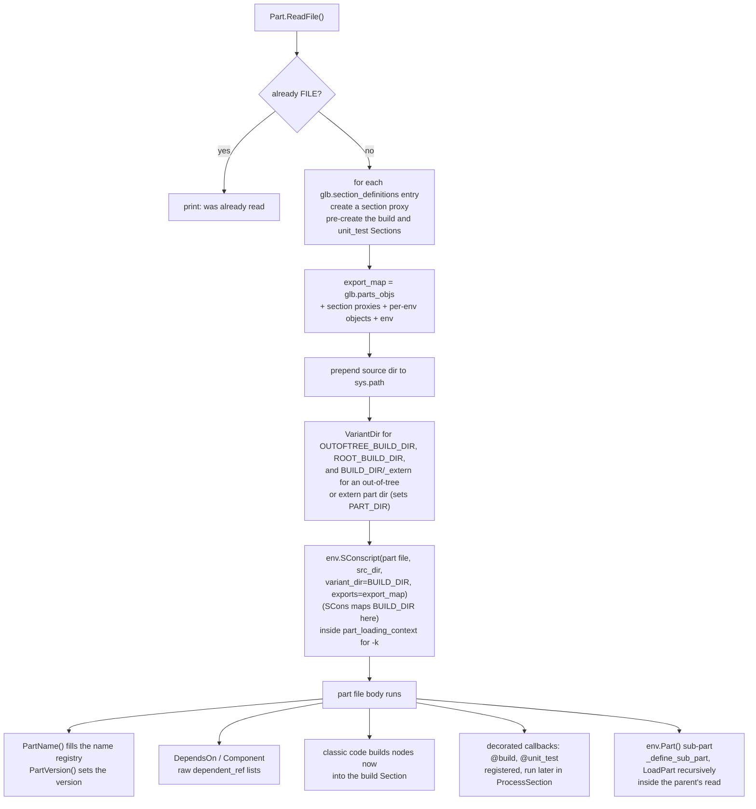
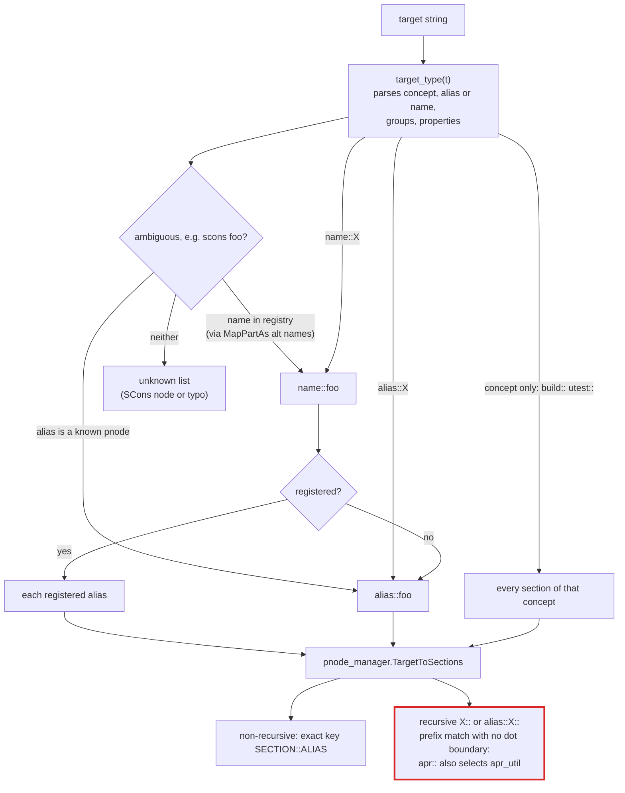

# L1/L2: Part loading

A Part goes through three states. The SConstruct **declares** it with `Part()`. `ProcessParts()` **reads** it by executing its part file. Then the sections in the target's closure are **processed**, which is when build nodes get their dependency data. Checkout and reading cover every declared Part; only processing is limited to what the targets need.

## Declaring a Part

What a declared Part has and lacks:

| Known before the read | Not known until the read |
| --- | --- |
| Alias (given, or `<stem>-<sig>` for `Part('A/A.parts')`), environment, part-file path, SCM objects, raw `requires=` list | Name from `PartName()`, version from `PartVersion()` (a declared root reports `0.0.0` unless `version=` was given), every Section, every dependency |

`Part(name=...)` stores the name but does not add it to the name registry. Only `PartName()` (through `Part._set_name()`) registers a name. Reading the `Name` or `ShortName` property of a declared Part whose name is unset sets the name to the alias and registers that alias as a name.

## ProcessParts

`part_manager.ProcessParts()`, called from `engine.Process()`:

- Reading is all-or-nothing: building one library clones and reads every declared Part, which in a large build means hundreds of checkouts and part files.
- An unmappable target makes Parts process every section, including `unit_test` sections, which a plain `scons all` would not process. A missing `--` in front of a flag is the usual cause.
- `extract_sources` together with other targets does not return early; it lands in the unknown list.

## Reading a part file

`LoadPart(pobj)` sets the read state to `FILE` and calls `Part.ReadFile()`:

A part file needs its source tree present when it is read:

- `PartVersion(GitVersionFromTag(...))` reads `env['SCM']['TAGS']`, a lazy value that calls the git SCM object's `get_git_data()`. That accessor runs `GetGitData()` (which runs `git tag --points-at HEAD`, or `HEAD^` when the Part sets `patchfile=`) only if its `_disk_data` memo is empty. The `NeedsToUpdate()` check may already have filled it (`do_force_logic()` and the modification test both read it), and `PostProcess()` empties it again only for an SCM queued for update or missing its cache file. `GitVersionFromTag` returns its default when no tag matches or `env['SCM']` has no `TAGS` (for example a `null_t` or `svn` main SCM). It reads only `env['SCM']`: a git `extern=` writes `SCM_EXTERN` and does not count.
- `Pattern()` lists source files at read time, and sub-part files are read from paths next to the parent.
- Site pieces that a part file calls also run during the read, so anything they query (a package repository, a network service) becomes part of reading.

So a part file cannot be read correctly from a part-file-only fetch.

## Mapping targets to sections

- `X::` is an ambiguous recursive target: it is tried as a name, then as an alias, and is unknown if it is neither.
- A `name::` target with an `@property` (for example `scons 'name::foo@platform_match:darwin-aarch64'`) fails in `map_targets_sections()` with `AttributeError: 'NoneType' object has no attribute 'ID'`, even when the property matches; the same name without the property maps normally. `target_type.MapToAliasTarget()` rewrites `name::foo` to `alias::ALIAS` by string replacement, so the property text stays glued to the alias, `TargetToSections()` returns `[None]`, and a verbose-message argument reads `.ID` on it. The bare form (`scons 'foo@platform_match:...'`) does not crash there: the replacement finds no `name::foo`, so it selects every build section and then reaches the `platform_match` removal in `map_scons_target_list()`, which raises `RuntimeError` on a mismatch ([04-sections-and-dependencies.md](04-sections-and-dependencies.md#matching-a-dependency)).
- `ALIAS_PREFIX` and `ALIAS_POSTFIX` are baked into aliases at setup; target mapping never applies them.
- `map_scons_target_list()` replaces `SCons.Script.BUILD_TARGETS` (an SCons `TargetList`) with a plain `list` of target strings (mostly section aliases), which has no `_add_Default` or `_clear`.
