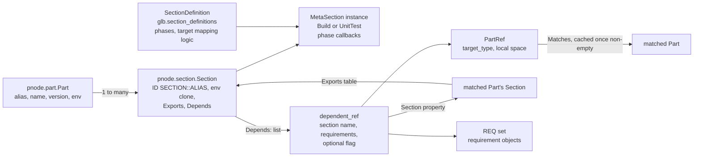
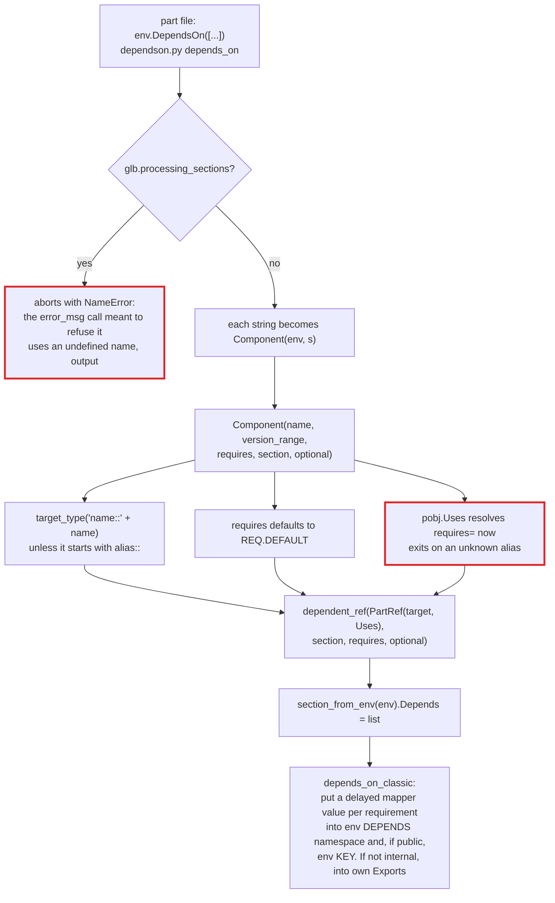
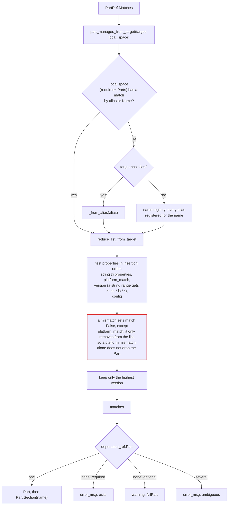
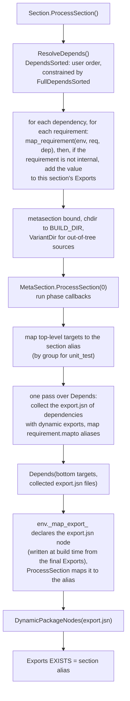
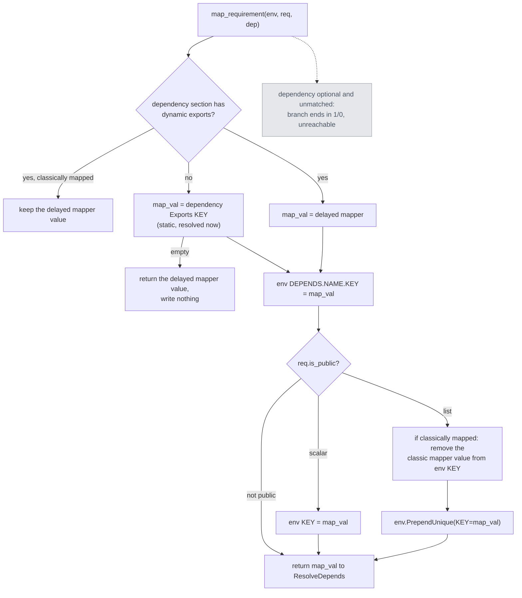
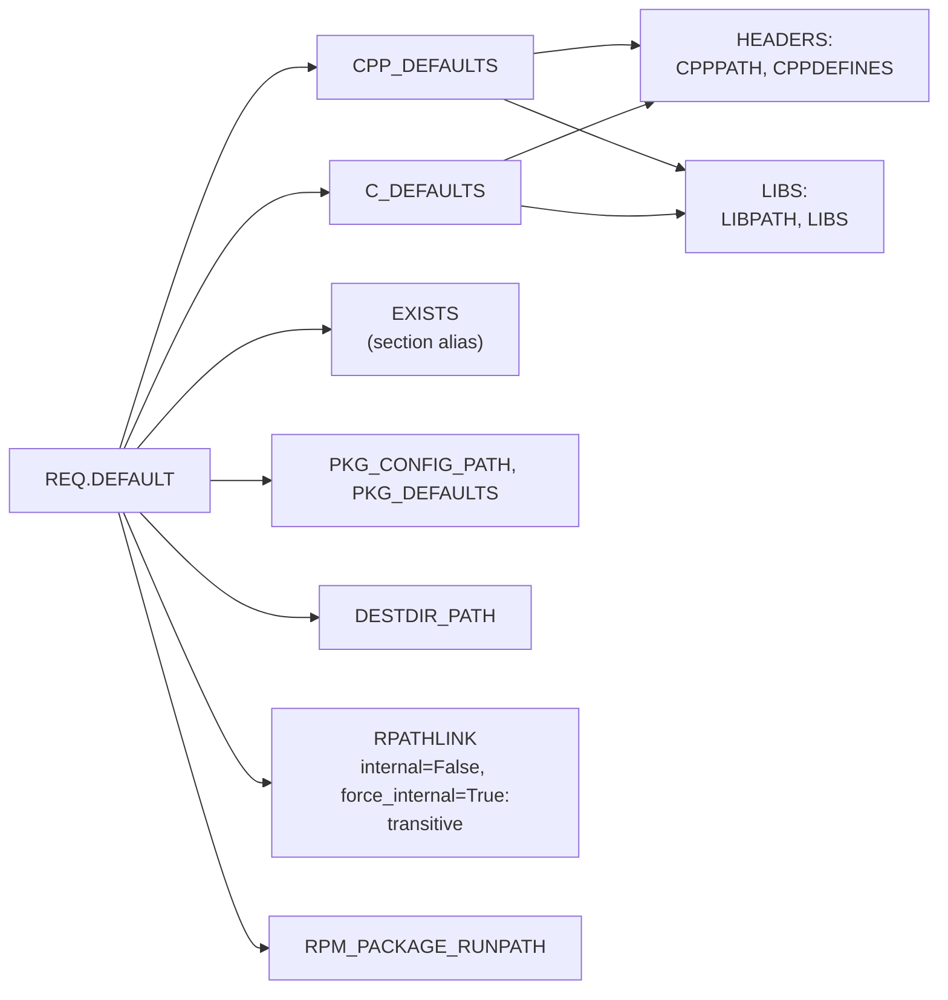

# L2: Sections and dependencies

A Part owns one Section per section type it uses (`build`, `unit_test`). A Section is the unit of dependency: `DependsOn()` records which Sections of which Parts this one needs and which requirements (include paths, libraries, and so on) to take from them. Requirements flow through each Section's **export table**.

## Objects

Section types registered with `api.register.add_section()`:

| Type | Concepts (target prefixes) | Phases, in order | Targets map by |
| --- | --- | --- | --- |
| `build` (`metasection/buildsection.py`) | `build`, `make`, `construct` | `configure` (runs inside `env.Configure()`), `config`, then the first of `source` (alias `build`), `sdk`, `system` | top-level targets |
| `unit_test` (`metasection/unittestsection.py`) | `utest`, `run_utest` | `build`, `run` (per group, with its own env clone and test context) | group |

A classic part file has no decorated callbacks; its body runs during the read and builds directly into the pre-created `build` Section.

## Declaring a dependency (read time)

Every dependency of a Part is known when its read completes, but nothing is resolved yet: `Section.Depends` is a plain list. Resolution happens when something asks a `PartRef` for its matches.

## Matching a dependency

- `PartRef.Matches` stores only a non-empty result, for the life of the object. A match made before every candidate was read sticks.
- The local-space loop reads `pobj.Name`, which on an unread Part writes its alias into the registry.
- `_from_alias()` returning `None` is appended as-is, and `reduce_list_from_target` then fails on `p.ID`.
- The `platform_match` branch of `reduce_list_from_target` does not filter: it calls `part_lst.remove(pobj)` and never sets `match = False`, so a platform mismatch alone does not drop the Part (a later `version` or `config` test still can). On the `PartRef` path the argument is a list, and the removal skips the next candidate. `map_scons_target_list()` passes a `set`, and there the removal raises `RuntimeError: Set changed size during iteration`. A bare target such as `scons 'foo@platform_match:win32-x86'` reaches it: `map_targets_sections()` selects every build section for it, and `map_scons_target_list()` then reduces the Parts named `foo` (probe: two Parts named `foo` on a darwin-aarch64 host; with a matching platform the higher version builds). Only the `name::` form of a registered name fails earlier ([03-part-loading.md](03-part-loading.md#mapping-targets-to-sections)).

## Processing a section

`Section.ProcessSection()` runs for each Section in the closure, dependencies first:

### map_requirement

## Requirements

A requirement names one variable and how it travels: `public` maps it into the consumer's top-level environment, `internal` keeps it from being re-exported to the consumer's own dependents, `force_internal` stops any set-level internal value from changing the requirement's own flag (including the `internal=True` that every `REQ.<SET>` lookup applies since 0.16, through `metaREQ.__getattr__`), `listtype` merges the value into a list instead of replacing it (`PrependUnique` into the consumer env, `extend_unique` into Exports), `mapto` binds extra aliases. Sets are defined with `DefineRequirementSet()` in `api/requirement.py`.

- Transitivity comes from `internal=False`: `ResolveDepends` copies such a value into the consumer's own Exports, so each level re-exports it to the next. `CPPPATH` is internal, so headers reach the immediate consumer and stop; `RPATHLINK` is `internal=False` and reaches the whole chain. `force_internal=True` on `RPATHLINK` matters for every dependency, because of the next point.
- Since 0.16, every `REQ.<SET>` lookup (through `metaREQ.__getattr__`), including `REQ.DEFAULT`, `Component()`'s default, builds its requirements with `internal=True`, which overrides each member's flag unless it has `force_internal`. While a Part whose env sets `COMPAT_REQ_INTERNAL` is being read (and its sub-parts, which are read inside it), `glb.compat_internal` is non-zero and lookups use `internal=False` instead, with a deprecation warning.
- Export tables are lists of lists (`Exports[KEY] == [[...]]`), and they are merged with `common.extend_unique`, which is O(n²).
- `append_unique` moves a repeated item to the end. That is deliberate link-order behaviour; keep it in any rewrite.
