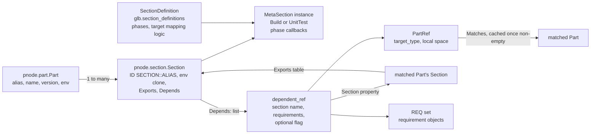
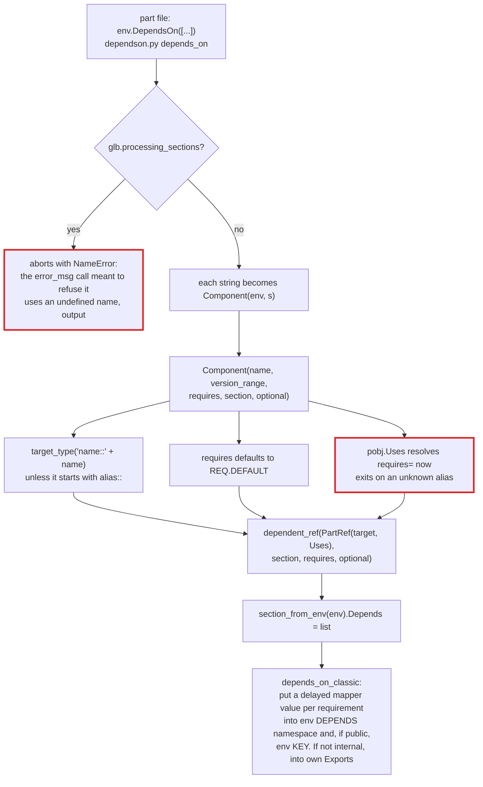
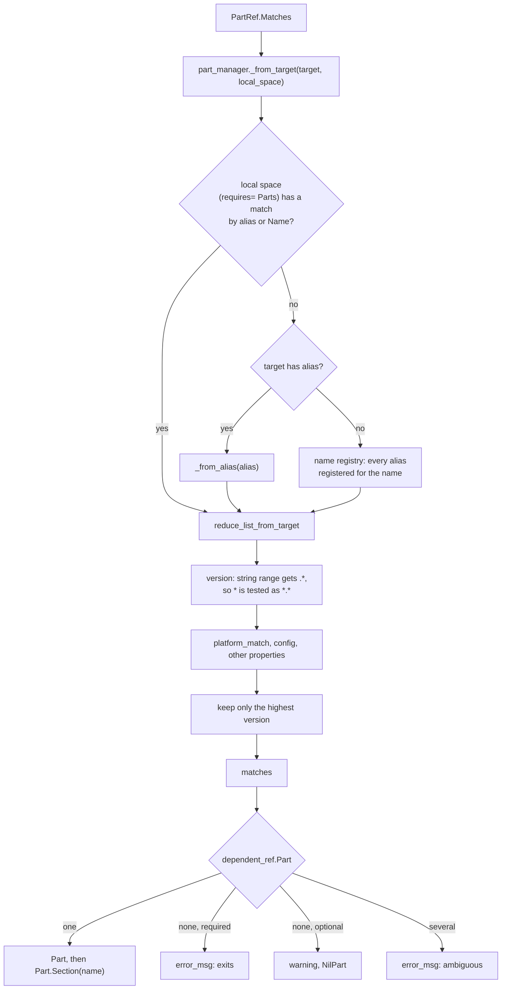
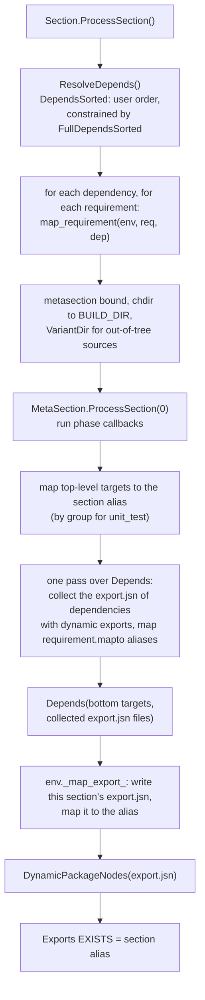
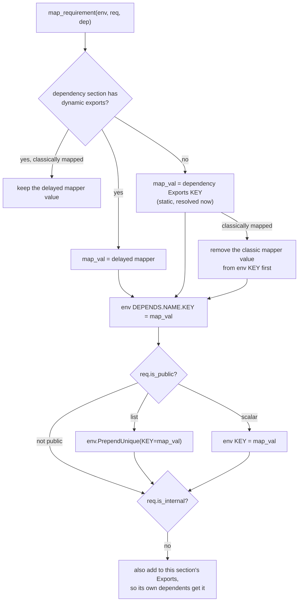
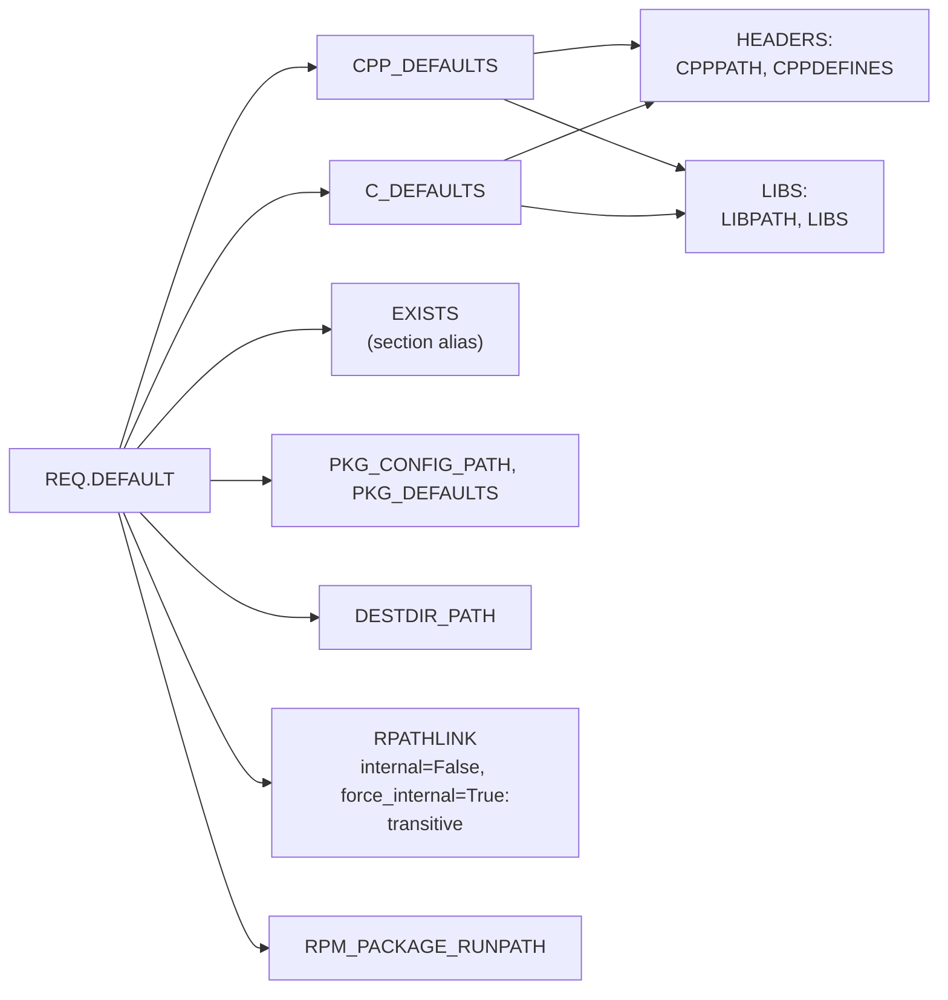

# L2: Sections and dependencies

A Part owns one Section per section type it uses (`build`, `unit_test`). A Section is the unit of dependency: `DependsOn()` records which Sections of which Parts this one needs and which requirements (include paths, libraries, and so on) to take from them. Requirements flow through each Section's **export table**.

## Objects

Section types registered with `api.register.add_section()`:

| Type | Concepts (target prefixes) | Phases, in order | Targets map by |
| --- | --- | --- | --- |
| `build` (`metasection/buildsection.py`) | `build`, `make`, `construct` | `configure` (runs inside `env.Configure()`), `config`, then the first of `source` (alias `build`), `sdk`, `system` | top-level targets |
| `unit_test` (`metasection/unittestsection.py`) | `utest`, `run_utest` | `build`, `run` (per group, with its own env clone and test context) | group |

A classic part file has no decorated callbacks; its body runs during the read and builds directly into the pre-created `build` Section.

## Declaring a dependency (read time)

Every dependency of a Part is known when its read completes, but nothing is resolved yet: `Section.Depends` is a plain list. Resolution happens when something asks a `PartRef` for its matches.

## Matching a dependency

- `PartRef.Matches` stores only a non-empty result, for the life of the object. A match made before every candidate was read sticks.
- The local-space loop reads `pobj.Name`, which on an unread Part writes its alias into the registry.
- `_from_alias()` returning `None` is appended as-is, and `reduce_list_from_target` then fails on `p.ID`.
- `reduce_list_from_target` removes items from the list it is iterating in its `platform_match` branch.

## Processing a section

`Section.ProcessSection()` runs for each Section in the closure, dependencies first:

### map_requirement

## Requirements

A requirement names one variable and how it travels: `public` maps it into the consumer's top-level environment, `internal` keeps it from being re-exported to the consumer's own dependents, `force_internal` routes it through the recursive export mapper, `listtype` appends instead of replacing, `mapto` binds extra aliases. Sets are defined with `DefineRequirementSet()` in `api/requirement.py`.

- Headers are direct-only: `CPPPATH` reaches the immediate consumer and stops. `RPATHLINK` reaches the whole chain because it is re-resolved at each level through the recursive `PARTIDEXPORTS` mapper. Setting `internal=False` on a requirement without `force_internal=True` does not make it transitive.
- Since 0.16, `REQ.DEFAULT` is `internal=True` by default. A part with `COMPAT_REQ_INTERNAL` set in its env gets the old behaviour and a deprecation warning.
- Export tables are lists of lists (`Exports[KEY] == [[...]]`), and they are merged with `common.extend_unique`, which is O(n²).
- `append_unique` moves a repeated item to the end. That is deliberate link-order behaviour; keep it in any rewrite.
