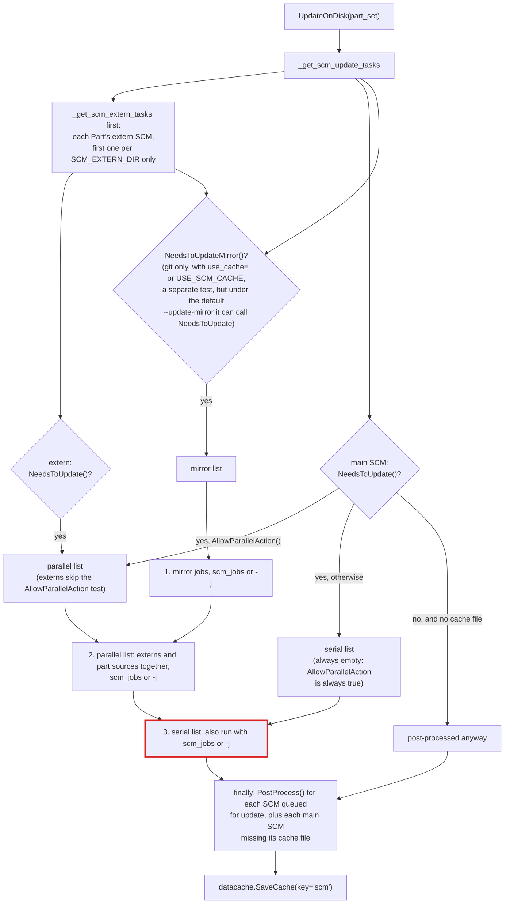
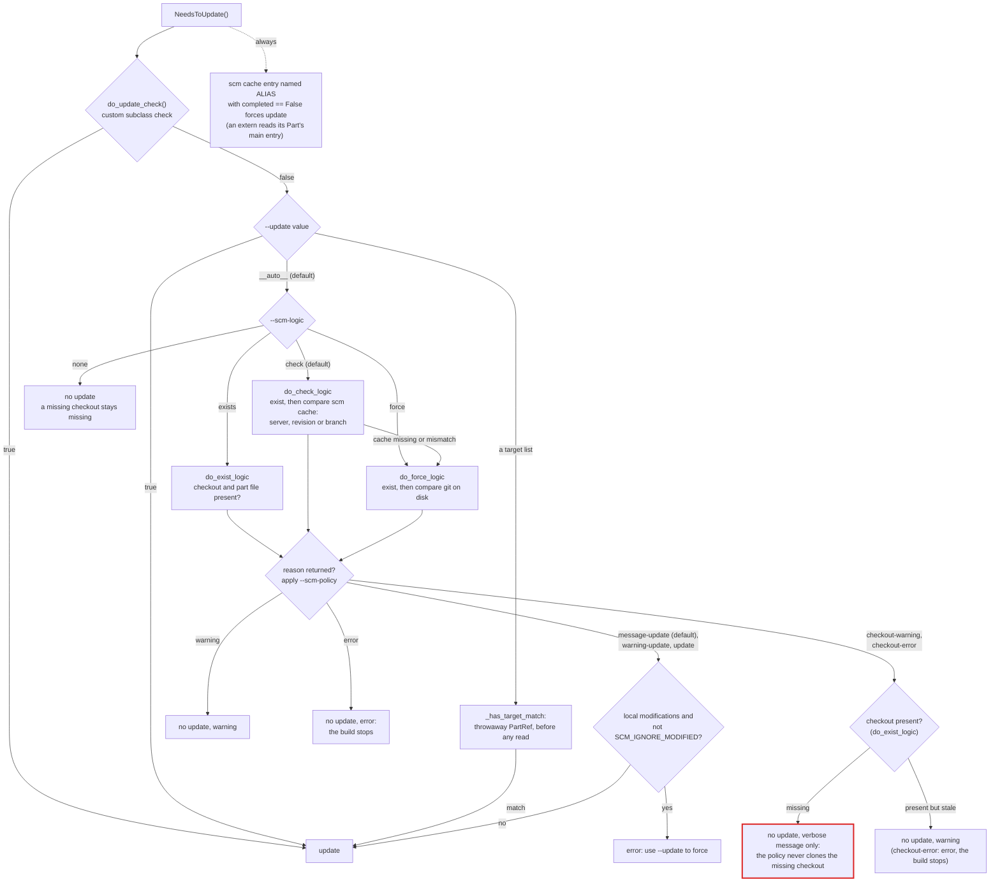
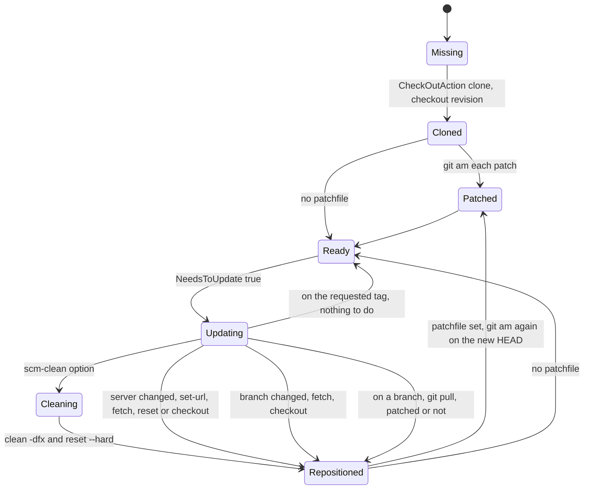

# L2: Source control (SCM)

Each Part has an SCM object (`scm_type=`, default `null_t('#')`) and optionally an extern SCM object (`extern=`) that holds only its part file. `part_manager.UpdateOnDisk()` asks every SCM object whether it needs to update, queues the ones that do, runs them with SCons' job runner, and records the result in the `scm` data cache.

## UpdateOnDisk

- Externs (part files) and the Parts' own sources share one parallel list. Externs are queued first, but nothing makes them finish before the source checkouts start.
- The serial list is passed to `do_disk_update()` with the same job count as the parallel list, so an SCM that disallows parallel actions would not be serialized when `scm_jobs` or `-j` is above 1. Today the list is always empty: `base.AllowParallelAction()` returns `True` (its comment says to read a policy later), no SCM class overrides it, and `ScmReuse.AllowParallelAction()` returns `self._scm.AllowParallelAction`, the bound method, without calling it. A bound method is always truthy, so a reusing Part would keep answering yes even once the base answer can be `False`.
- A git extern stores its cache entry as `extern<SHORT_REQUEST_HASH>`, but the failed-run check at the end of `NeedsToUpdate()` reads the entry named after the Part's alias (`env['ALIAS']`). So an extern's own `completed == False` is never read back; the extern sees its Part's main entry instead. Only that fallback is affected: `do_check_logic()` reads the right entry, so a missing or mismatched extern checkout, or `--update`, still updates it.
- `completed == False` is also rarely written. In `scm/update_task.py`, `failed()` reports the error and stops the taskmaster but never sets the task's failure flag; only `exception_set()` does, and `postprocess()` passes `not failed` to `ProcessResult()`. So when `UpdateOnDisk()` returns non-zero (the ordinary failure path), git's `PostProcess()` still records `completed: True` with the requested server, branch, and revision, and the recorded-failure force-update fires only when an exception escapes the task. Under the default `--update=__auto__` and `--scm-logic=check`, a Part that names its branch, tag, or revision then finds a matching entry on the next run and is retried only if the existence check fails.
- `task_master.append()` also dedupes by `CheckOutDir` within one list. All `null_t` Parts share the SConstruct directory as `CheckOutDir`.
- `ScmReuse` resolves the referenced Part by alias and forwards every SCM call to that Part's SCM object. Used as `extern=`, every reusing Part resolves `SCM_EXTERN_DIR` to the same `#_extern//`, so only the first is checked.
- There is no sparse checkout, and nothing in `scm/` asks for a partial clone (`--filter`); the clone command does substitute `${GIT_CLONE_ARGS}`. A checkout is a full working tree even when only the part file is needed.

## The update decision

`scm/base.py NeedsToUpdate()` caches its answer per SCM object for the run.

With the defaults (`--update=__auto__`, `--scm-logic=check`, `--scm-policy=message-update`), a missing checkout is cloned. A cached server, revision, or branch that differs from the request only sends `do_check_logic` on to `do_force_logic`, so a clean checkout is updated only if the checkout on disk differs too. The local-modification check runs only on the three policy branches that update. A custom `do_update_check()`, `--update=true`, and a target-list match go straight to update; the git update itself then refuses local modifications unless `--scm-clean` or `SCM_IGNORE_MODIFIED` is set.

The `checkout-warning` and `checkout-error` policies stay quiet about a missing checkout (`do_exist_logic()` returns a reason, and the branch only logs it at verbose level) and report a present-but-stale one. Neither variant clones a missing checkout: every policy except the three updating ones leaves the answer `False`, and under `--update=__auto__` only a recorded `completed == False` from a failed earlier run still forces an update (which, as noted above, is rarely recorded). The option help lists the values without saying what they do, and the branch structure goes back to the repository's first commit (2015); the names suggest "check out if missing, then warn", so confirm the intent before relying on either reading.

## Git: checkout, update, and patches

`scm/git.py` class `git`. `CheckOutAction` clones; `UpdateAction` brings an existing checkout to the request. Patches come from `patchfile=` (one file or a list) and are applied with `git am`, in list order.

- On a branch, an update runs `git pull` even when patches are applied, and then runs `git am` for every patch again on top of the result. The earlier patch commits are still in HEAD at that point, so `git am` is asked to apply patches that are already applied.
- A failed `git am` leaves `.git/rebase-apply` behind. Neither `clean -dfx` nor `reset --hard` removes it, and `UpdateAction` does not end it, so later `git am` runs refuse until someone runs `git am --abort` in the checkout.
- `GetGitData()` (`env.GitInfo()`) runs `git status -s -b`, `git tag --points-at`, `git rev-parse HEAD`, and `git remote -v` on every call. The git SCM object caches the result in `_disk_data` through `get_git_data()` until `PostProcess()` resets it; the lazy `env['SCM']` values (`TAGS`, `BRANCH`, `REVISION`, ...) and the update checks read through that accessor. When a `patchfile` is set, the tag lookup uses `HEAD^` instead of `HEAD`, which is the checked-out revision only when the patches added exactly one commit. `GitVersionFromTag` reads these tags.
- `PostProcess()` writes `{server, branch, revision, completed}` through `datacache.StoreData(..., key='scm')`, which lands in `.parts.cache/scm/<name>.cache`. This cache is not under the run key, so it survives a re-key. The patch list is not recorded, so a changed patch list is not detected.
- The extern `REQUEST_HASH` is an md5 of server, repository, and branch or revision. Two Parts with the same extern but different patches share one checkout.

## Read-time consequences

The checkout must exist before a part file is read ([03-part-loading.md](03-part-loading.md#reading-a-part-file)). That is why `UpdateOnDisk()` runs for every declared Part before any `LoadPart()`.
