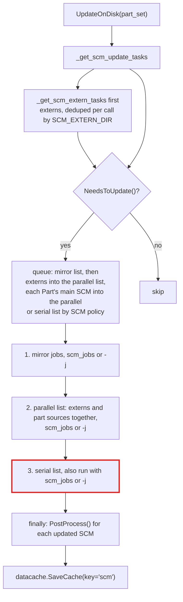
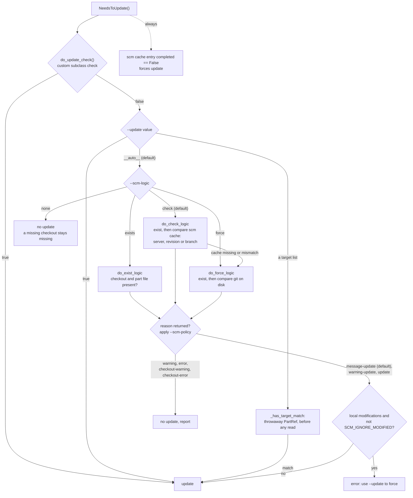
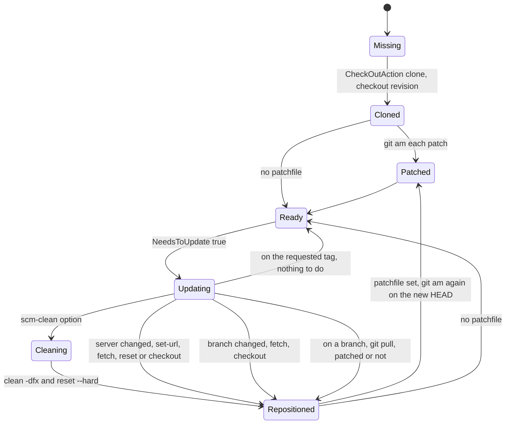

# L2: Source control (SCM)

Each Part has an SCM object (`scm_type=`, default `null_t('#')`) and optionally an extern SCM object (`extern=`) that holds only its part file. `part_manager.UpdateOnDisk()` asks every SCM object whether it needs to update, queues the ones that do, runs them with SCons' job runner, and records the result in the `scm` data cache.

## UpdateOnDisk

- Externs (part files) and the Parts' own sources share one parallel list. Externs are queued first, but nothing makes them finish before the source checkouts start.
- The serial list is passed to `do_disk_update()` with the same job count as the parallel list, so an SCM that disallows parallel actions is not serialized when `scm_jobs` or `-j` is above 1.
- `task_master.append()` also dedupes by `CheckOutDir` within one list. All `null_t` Parts share the SConstruct directory as `CheckOutDir`.
- `ScmReuse` resolves the referenced Part by alias and forwards every SCM call to that Part's SCM object. Used as `extern=`, every reusing Part resolves `SCM_EXTERN_DIR` to the same `#_extern//`, so only the first is checked.
- There is no sparse checkout, and nothing in `scm/` asks for a partial clone (`--filter`); the clone command does substitute `${GIT_CLONE_ARGS}`. A checkout is a full working tree even when only the part file is needed.

## The update decision

`scm/base.py NeedsToUpdate()` caches its answer per SCM object for the run.

With the defaults (`--update=__auto__`, `--scm-logic=check`, `--scm-policy=message-update`), a missing checkout is cloned and a clean checkout whose cached server, revision, or branch differs is updated. The local-modification check runs only on the three policy branches that update. A custom `do_update_check()`, `--update=true`, and a target-list match go straight to update; the git update itself then refuses local modifications unless `--scm-clean` or `SCM_IGNORE_MODIFIED` is set.

## Git: checkout, update, and patches

`scm/git.py` class `git`. `CheckOutAction` clones; `UpdateAction` brings an existing checkout to the request. Patches come from `patchfile=` (one file or a list) and are applied with `git am`, in list order.

- On a branch, an update runs `git pull` even when patches are applied, and then runs `git am` for every patch again on top of the result. The earlier patch commits are still in HEAD at that point, so `git am` is asked to apply patches that are already applied.
- A failed `git am` leaves `.git/rebase-apply` behind. Neither `clean -dfx` nor `reset --hard` removes it, and `UpdateAction` does not end it, so later `git am` runs refuse until someone runs `git am --abort` in the checkout.
- `GetGitData()` (`env.GitInfo()`) runs `git status -s -b`, `git tag --points-at`, `git rev-parse HEAD`, and `git remote -v`. It is cached per object until `PostProcess()` resets it. When a `patchfile` is set, the tag lookup uses `HEAD^` instead of `HEAD`, which is the checked-out revision only when the patches added exactly one commit. `GitVersionFromTag` reads these tags.
- `PostProcess()` writes `{server, branch, revision, completed}` through `datacache.StoreData(..., key='scm')`, which lands in `.parts.cache/scm/<name>.cache`. This cache is not under the run key, so it survives a re-key. The patch list is not recorded, so a changed patch list is not detected.
- The extern `REQUEST_HASH` is an md5 of server, repository, and branch or revision. Two Parts with the same extern but different patches share one checkout.

## Read-time consequences

The checkout must exist before a part file is read ([03-part-loading.md](03-part-loading.md#reading-a-part-file)). That is why `UpdateOnDisk()` runs for every declared Part before any `LoadPart()`.
