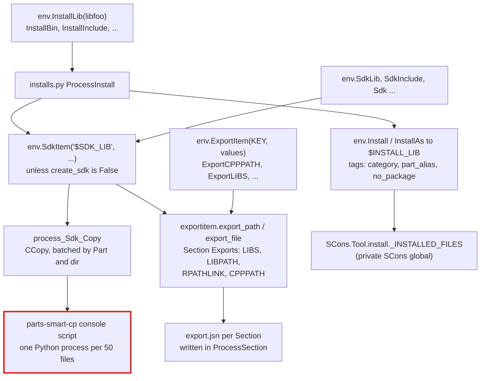
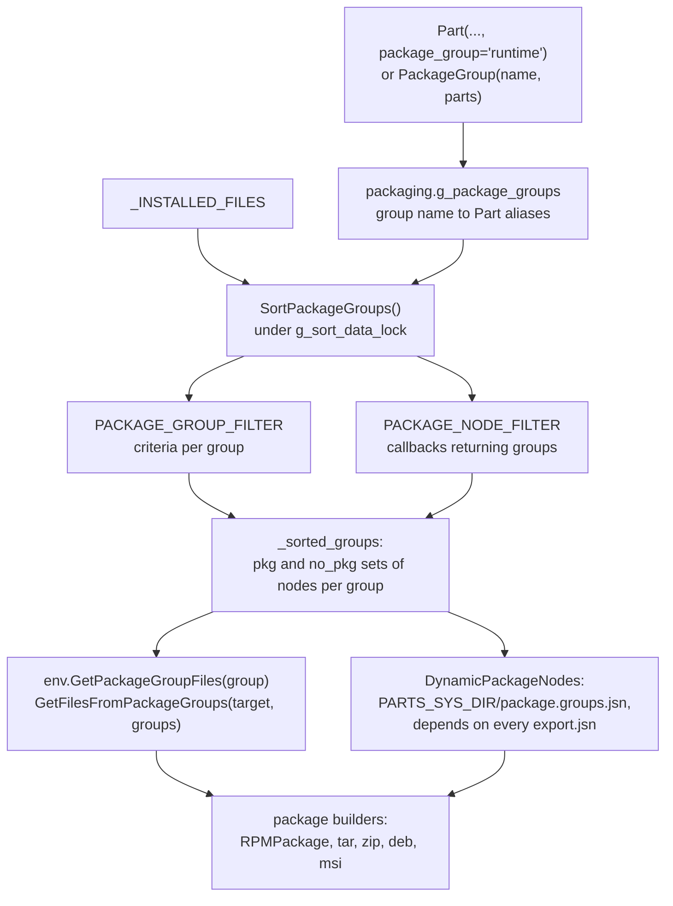
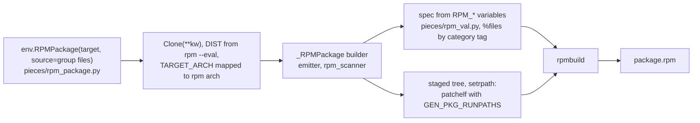

# L2: SDK, install, and packaging

A Part publishes outputs in two directions. **SDK** calls copy files into `$SDK_ROOT` and add entries to the Section's export table, which is how dependents find headers and libraries. **Install** calls copy files into `$INSTALL_ROOT` and tag them for packaging. Package builders such as `RPMPackage` then collect installed files by **package group**.

## From a part file to the export table and the install tree

- The install and SDK directories come from variables such as `INSTALL_ROOT`, `INSTALL_LIB`, `SDK_ROOT`, `SDK_LIB`. A gold test commonly sets `SetOptionDefault('INSTALL_ROOT', '#_install')`.
- `InstallTarget` and the `Sdk*` functions return the copied nodes; the copy builder is `core/builders/ccopy.py` (`CCOPY_LOGIC`: `default`, `copy`, `hard-copy`; default `hard-copy`).
- Dependents consume the export table, not the SDK file nodes: `SDKLIB`/`SDKBIN` are not in `REQ.DEFAULT`.

## Package groups

- Packaging is lazy: the group sets are re-sorted when the number of installed files changes, so a package builder sees files installed by Sections processed after it was declared.
- `PackageGroup()` sets `g_resort_package_data = True` without a `global` statement, so that assignment is local and never forces a re-sort.
- A file in two groups is reported through `PACKAGE_DUPLICATE_FILES_HANDLING` (`error`, `warning`, or ignore).

## RPM

- `RPMPackage()` returns the built package nodes. Copying them to a collection directory is up to the part file (for example `env.CCopy(DIR, out)`).
- The default `RPM_RUNPATH` holds both `$ORIGIN`-relative and absolute entries. The absolute ones (`GEN_PKG_RUNPATHS(..., use_origin=False)`) take every library path as given, loader defaults included: with `PACKAGE_ROOT` left at `/`, `PACKAGE_LIB` is `/lib`, and rpmbuild's `check-rpaths` on Red Hat based systems rejects a standard runpath such as `/lib`.
- `X_RPM_OBSOLETES` (`obsoletes=`) emits an `Obsoletes:` header.
