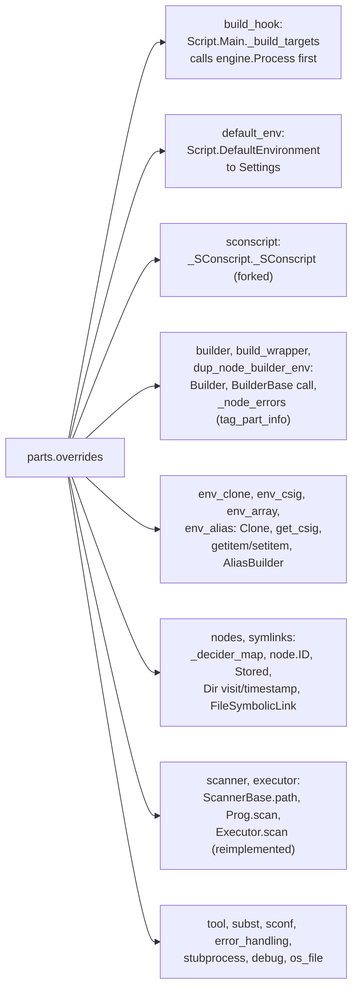
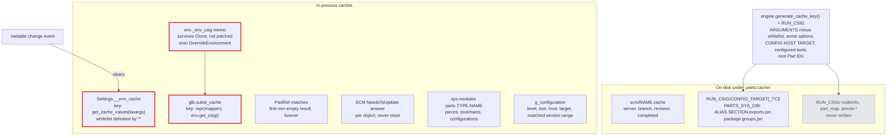
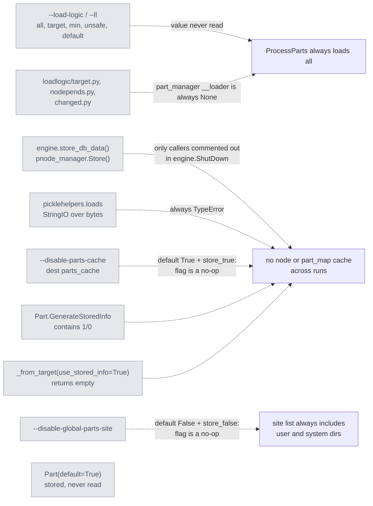

# L3: Overrides, caches, and dead code

Parts is to a large degree a monkeypatch layer over SCons internals. This page lists what it patches, every cache it keeps and what invalidates it, the code paths that look live but are not, and the measured hotspots. Read it before you change anything that touches SCons nodes, signatures, or the build decision.

## The overrides layer

`import parts.overrides` (from `main.py`, before the engine exists) replaces these process-wide:

Classes of risk, read against SCons 4.10.1:

| Class | Examples |
| --- | --- |
| Silent wrong behaviour today | Decider override binds `func` late: all 7 `_decider_map` slots call the last decider (content hash), so `env.Decider('timestamp-match')` is ignored. `PartsClone` has no `variables` parameter and passes `parse_flags` positionally into SCons' `variables` slot (`Clone(tools, toolpath, variables, parse_flags)`), so `Clone(parse_flags=...)` is misrouted and `variables=` becomes a construction variable. `BUILD_TARGETS` becomes a plain `list` |
| Forked bodies that drift | `Executor.scan`, `_node_errors`, `_SConscript` (`must_exist` default differs from SCons 4.6+), `find_deepest_user_frame`, `AliasBuilder`, `_concat_ixes` |
| Private-symbol patches | `SCons.Util._semi_deepcopy_*`, `SCons.Builder._null`, `Prog.scan` by `__code__` swap, `SCons.Tool.install._INSTALLED_FILES` |
| Not versioned against SCons | `.parts.cache` stores nothing derived from the SCons version. The `DirNodeInfo`/`DirBuildInfo` overrides change the shape of `.sconsign` entries while keeping SCons' `current_version_id` |

## Caches and their keys

- `glb.subst_cache` can serve one Part's mapper result to another: the `get_csig` memo is copied by `Clone()`, and `runpath_mapper`'s `repr` is the same constant for every Part, so a stale key can put one Part's RPATH into another Part's link line.
- The run key names the data-cache directory; it does not sign build outputs. A new `ARGUMENTS` entry re-keys it once (a slower first run, not a rebuild). `USE_CACHE_KEY=...` on the command line forces a key.
- `generate_cache_key()` records an option's default, not the value given, when the option differs from its default (read in code, not tested), so two non-default values of the same option give the same key.
- `.parts.cache` has a Parts format key (`datacache.db_key`, "DB Cache Version 1.3.0" plus the entry length, and a per-entry `__version__`) but nothing derived from the SCons version. `BuildInfo` is not pickled into it on the live path; only `pnode_manager.Store()`/`StoreAlias()` would do that, and they never run.
- `ClearNodeStates()` at the end of `ProcessParts()` resets every node's `_memo`, so the build phase re-stats everything.

## Dead code

These paths exist and look usable. They are not. Do not build on them without reviving them first.

Also dead or inert: `overrides/scons_util.py` (Python 2 `UniqueList`), the `Subst.Literal.__hash__` override (identical to SCons'), the `sconf.py` backport, `core/util/sdk_gen.py`, and the commented-out `INSTALL*`/`SDK*` requirement sets in `api/requirement.py`.

## Known hotspots

Measured with a synthetic benchmark (N Parts, layered `DependsOn` fan-out 3, `Textfile` and `InstallTarget` only, no compiler) in August 2026. The numbers are indicative; the benchmark has not been re-run at the commit these pages describe.

| Rank | Hotspot | Where | State |
| --- | --- | --- | --- |
| 1 | `parts-smart-cp` starts a Python interpreter per batch of 50 files (about 18 s of 25 s at 150 Parts) | `core/builders/ccopy.py` | Open |
| 2 | Subst dispatch: `eval` plus `inspect.signature` on every `${MAPPER(...)}` (about 15 µs) | SCons `Subst`, `overrides/subst.py` has no memo | Open |
| 3 | O(n²) `append_unique` / `extend_unique` / `make_unique`, run per command line through Parts' `_concat` | `core/util/list_ops.py`, `mappers.py` | Open; keep last-occurrence-wins |
| 4 | Toposort cluster: list membership tests, a full rescan per round, `FullDependsSorted` per section | `pnode/section.py` | Open |
| 5 | `node.ID` recomputed on every read, called per decider edge | `overrides/nodes.py` | Open |
| 6 | `ClearNodeStates()` wipes every memo before the build | `pnode/pnode_manager.py` | Open |
| 7 | ANSI stripping char by char whenever stdout is not a tty, so every CI run | `ansi_stream.py _WriteNoColor` | Open |
| 8 | More than a hundred of the roughly 540 verbose/trace calls build their arguments eagerly; `_empty_msg` only drops the call | everywhere | Open; wrap in `common.DelayVariable` |

Fix the correctness items first (decider closure, subst-cache key) before trusting any incremental-build or subst benchmark: both distort the baseline.
