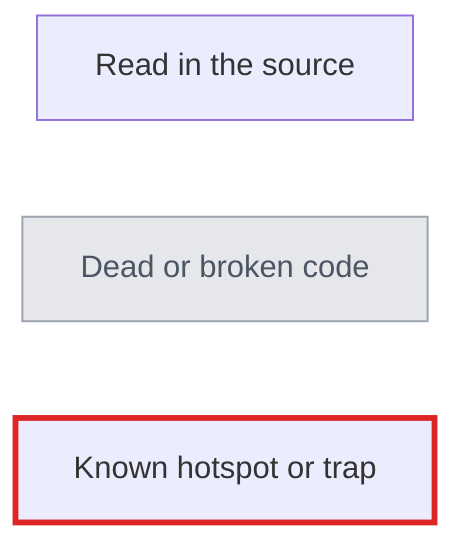

# Parts architecture maps

Layered diagrams of how Parts (scons-parts) runs, from the whole process down to the subsystems. Each page goes one level deeper than the one before it. The diagrams are Mermaid; GitHub renders them in place.

| Page | Level | Covers |
| --- | --- | --- |
| [00-overview.md](00-overview.md) | L0 | System context, the process lifecycle, module map |
| [01-startup.md](01-startup.md) | L1 | `import parts`, `engine.Start()`, start-up phases and hooks, variable precedence, site search path |
| [02-environments-toolchains-config.md](02-environments-toolchains-config.md) | L1/L2 | How an environment is built: settings cache, toolchain resolution, configuration selection and merge |
| [03-part-loading.md](03-part-loading.md) | L1/L2 | `Part()` declaration, `ProcessParts()`, part-file reading, target mapping, the closure |
| [04-sections-and-dependencies.md](04-sections-and-dependencies.md) | L2 | Sections and phases, `DependsOn`/`Component`, dependency matching, requirements and the export table |
| [05-scm.md](05-scm.md) | L2 | `UpdateOnDisk()`, the update decision, git checkout/update/patch handling, the `scm` cache |
| [06-sdk-install-packaging.md](06-sdk-install-packaging.md) | L2 | SDK and install targets, package groups, RPM packaging |
| [07-overrides-caches-dead-code.md](07-overrides-caches-dead-code.md) | L3 | The SCons monkeypatch layer, every cache and its key, dead code paths, known hotspots |

## Code state

Every diagram describes `main` at `8d6c7a2` (2026-09-12). Names are given as `file.py function()` rather than line numbers, because line numbers drift. Where a line number appears it is for that commit.

## Legend

Diagrams use these node styles:

## Sources

These maps were assembled from a read of the source at the commit above. The user documentation for configurations is [doc/source/concepts/configurations.rst](../source/concepts/configurations.rst); for toolchains, [toolchains.rst](../source/concepts/toolchains.rst).

## Keeping these current

- When code a node names is renamed or moved, fix the node in the same change.
- Keep each diagram under about 25 nodes. Split a diagram rather than grow it.
- In Mermaid labels, quote any text with `::`, `#`, `$`, brackets, or parentheses: `A["build::foo"]`. Unquoted, `::` is read as class syntax. Do not put a semicolon in a label.
